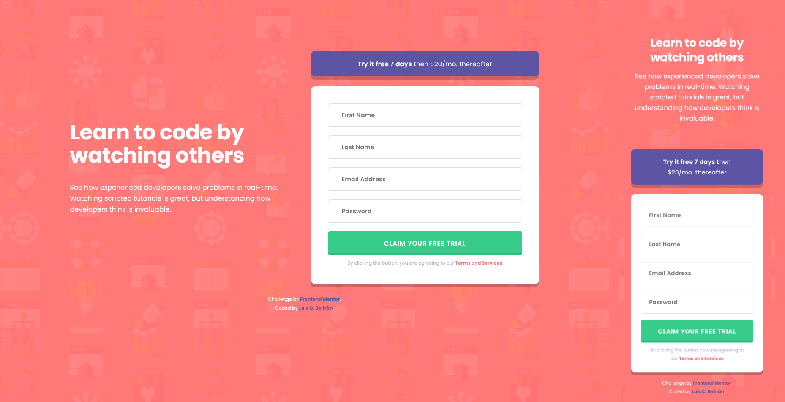

# Frontend Mentor - Intro component with sign up form solution

This is a solution to the [Intro component with sign up form challenge on Frontend Mentor](https://www.frontendmentor.io/challenges/intro-component-with-signup-form-5cf91bd49edda32581d28fd1). Frontend Mentor challenges help you improve your coding skills by building realistic projects. 

## Table of contents

- [Overview](#overview)
  - [The challenge](#the-challenge)
  - [Screenshot](#screenshot)
  - [Links](#links)
- [My process](#my-process)
  - [Built with](#built-with)
  - [What I learned](#what-i-learned)
  - [Continued development](#continued-development)
  - [Useful resources](#useful-resources)
- [Author](#author)
- [Acknowledgments](#acknowledgments)

## Overview

### The challenge

Users should be able to:

- View the optimal layout for the site depending on their device's screen size
- See hover states for all interactive elements on the page
- Receive an error message when the `form` is submitted if:
  - Any `input` field is empty. The message for this error should say *"[Field Name] cannot be empty"*
  - The email address is not formatted correctly (i.e. a correct email address should have this structure: `name@host.tld`). The message for this error should say *"Looks like this is not an email"*

### Screenshot

### Links

- Solution URL: [https://github.com/LuisCBeltran/intro-component-with-signup-form-master](https://github.com/LuisCBeltran/intro-component-with-signup-form-master)
- Live Site URL: [https://luiscbeltran.github.io/intro-component-with-signup-form-master/](https://luiscbeltran.github.io/intro-component-with-signup-form-master/)

## My process

### Built with

- Semantic HTML5 markup
- CSS
- Flexbox
- CSS Grid
- Mobile-first workflow
- JavaScript

### What I learned

I learned how to call different JavaScript functions with just one button and validate empty forms.

### Continued development

I will continue focusing on how to improve interactivity with JavaScript. At the same time, I will be practicing even more my HTML and CSS skills.

## Author

- Website - [Luis C. Beltrán](https://github.com/LuisCBeltran)
- Frontend Mentor - [@LuisCBeltran](https://www.frontendmentor.io/profile/LuisCBeltran)
- Twitter - [@luisc_beltran](https://twitter.com/luisc_beltran)
